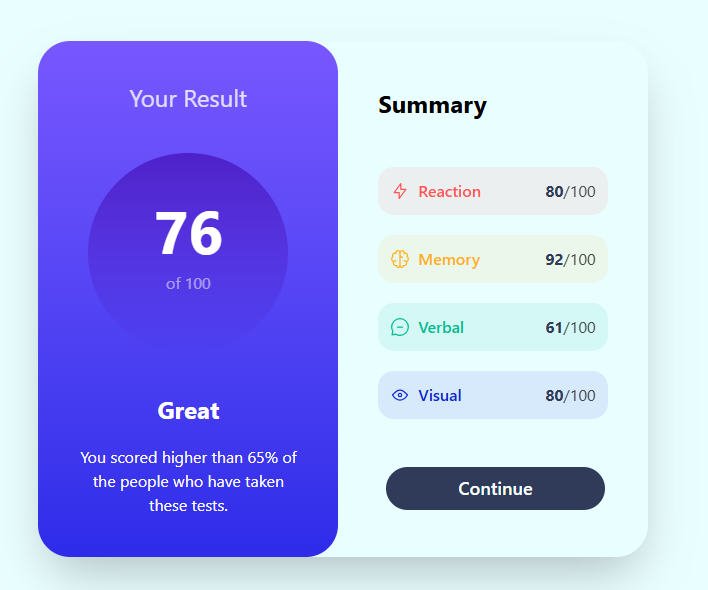

## Table of contents
  - [Screenshot](#screenshot)
  - [Links](#links)
  - [Built with](#built-with)
  - [What I learned](#what-i-learned)
  - [Continued development](#continued-development)
  - [Useful resources](#useful-resources)
- [Author](#author)

### Screenshot

### Links

- Live Site URL: [Add live site URL here](https://your-live-site-url.com)

### Built with
-jsx
- tailwind
- Mobile-first workflow
- [React](https://reactjs.org/) - JS library

### What I learned

i learned about responsiveness and gradients
### Continued development

i will learn more about transitions gradients and responsiveness

### Useful resources

- [ resource ](www.chatgpt.com) - This helped me to understand gradients and responsive designs 

## Author

- Website - [vivek](https://www.your-site.com)
- Frontend Mentor - [@vivekcore](https://www.frontendmentor.io/profile/vivekcore)
- Twitter - [@vivek_0__0](https://www.twitter.com/vivek_0__0)
